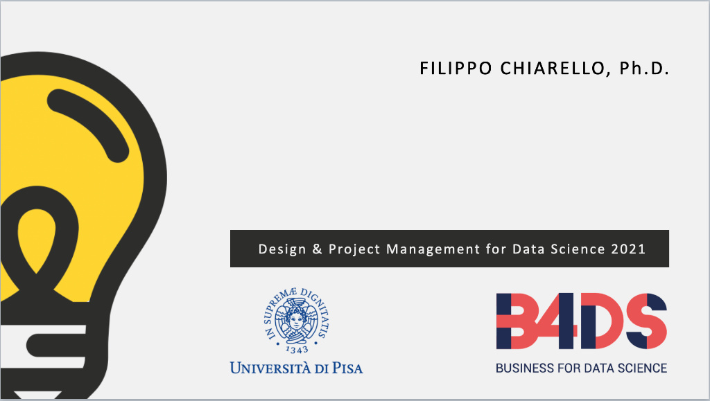

# FAI Accessibility: Project Design & Management for Data Science

## Abstract
Questo repository contiene gli artefatti e i dataset sviluppati come progetto finale per il corso di *Project Design & Management for Data Science* presso l'**Università di Pisa (UniPi)**. 

L'obiettivo dello studio è l'identificazione e la strutturazione di soluzioni *data-driven* atte a migliorare l'accessibilità e la fruizione dei beni culturali gestiti dal **FAI (Fondo Ambiente Italiano)**, applicando rigorose metodologie di Project Management e analisi dei dati.

## Obiettivi del Progetto
* **Mappatura Strategica:** Identificazione degli stakeholder e analisi approfondita dei bisogni degli utenti attraverso metodologie di *User Converge*.
* **Analisi di Accessibilità:** Valutazione quantitativa dell'impatto dei trasporti sull'effettiva raggiungibilità dei siti culturali.
* **Progettazione e Valutazione:** Sviluppo di una proposta di valore supportata da evidenze empiriche, validata attraverso framework analitici (SWOT Analysis).

## Contenuto della Repository

* 📄 **`Project Design.pdf`**: Il report accademico completo. Documenta l'intero ciclo di vita del progetto, includendo la profilazione degli utenti, il *Needs Assessment* (con metriche di importanza e confidenza), l'identificazione della soluzione e la valutazione strategica.
* 📊 **`dataTrasporti (1).csv`**: Dataset strutturato elaborato per il progetto. Mappa i beni FAI incrociandoli con parametri logistici e di trasporto (coordinate geografiche, disponibilità di mezzi pubblici, tempi di percorrenza e distanze dai principali snodi ferroviari centrali).

## Metodologia
Il progetto è stato condotto seguendo le best practice del Project Management applicato ai dati, articolandosi nelle seguenti fasi:

1. **Ricerca e Identificazione (Discovery):** Analisi del mercato e degli utenti sfruttando fonti di dati aperte e trend di ricerca (es. Google Trends, Social Media analysis).
2. **Needs Assessment:** Valutazione e prioritizzazione dei pain-point degli utenti, quantificando le ipotesi di bisogno.
3. **Solution Design:** Progettazione di un intervento basato sui dati (fortemente guidato dalle evidenze emerse dall'analisi spaziale e dei trasporti).
4. **Valutazione di Fattibilità:** Analisi strutturata dei punti di forza, debolezza, opportunità e minacce (SWOT) associati alla soluzione proposta.

## Autori
Progetto di ricerca realizzato dal team:
* **Cristian Leone**
* **Sara Pilato**
* **Riccardo Pisano**
* **Carlo Bardazzi**

---
*Progetto realizzato per il corso di Project Design & Management for Data Science. Università di Pisa.*